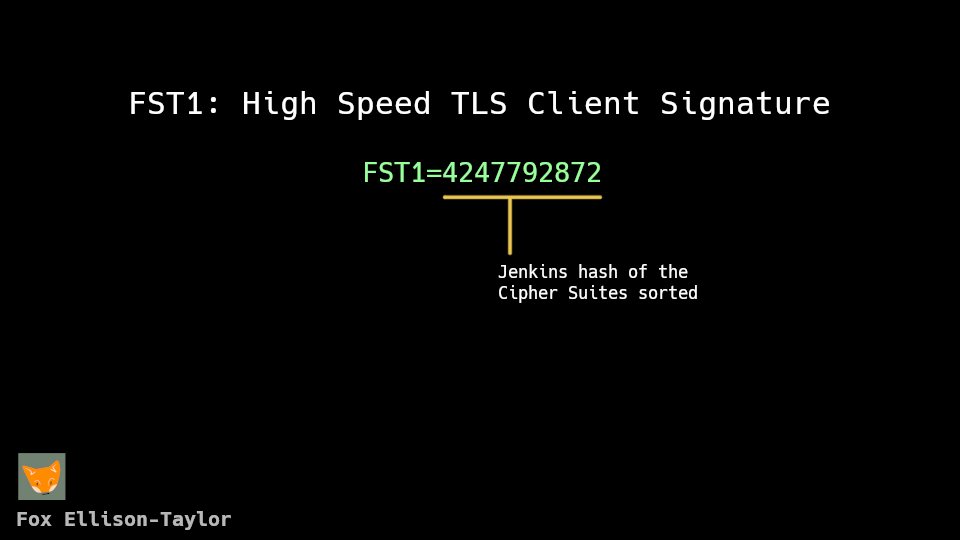

# FST1: TLS Client Fingerprinting

## FST1 Algorithm

[Jenkins hash](https://en.wikipedia.org/wiki/Jenkins_hash_function) of the Cipher Suites sorted.
Iterated by each uint16 instead of each uint8 like the original hashing algorithm.

The fingerprint will look like: `4247792872` if represented as a uint32.
