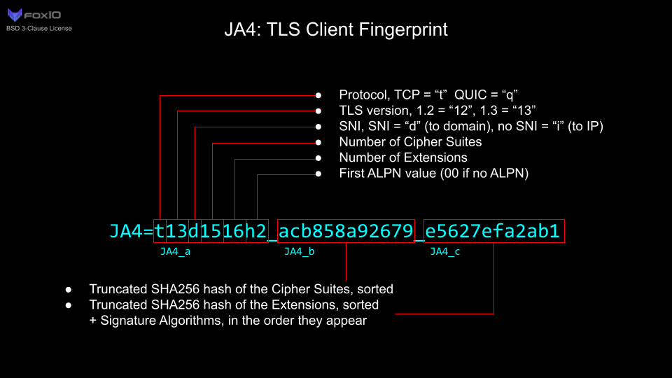
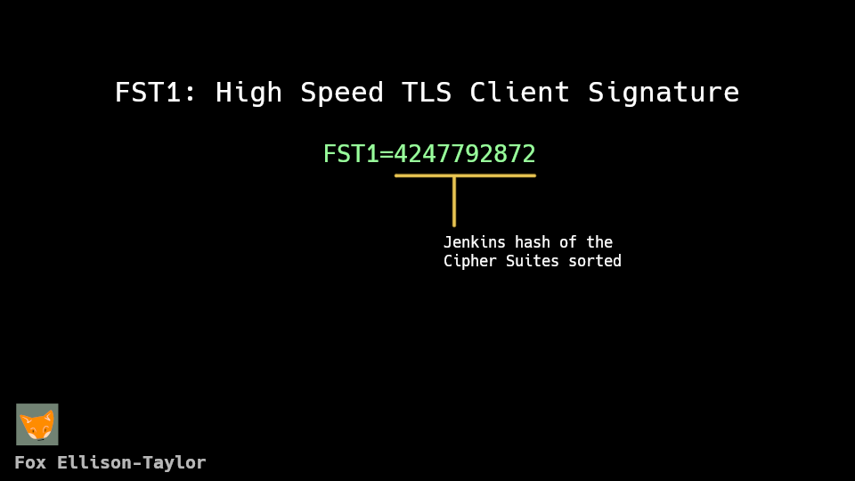

## How I Block All 26 Million Of Your Curl Requests

Bots have always been a problem on the internet, be it DDOSing, AI scrapers, it's a treadmill
problem no solution will ever be perfect, but we can block at many minimum effor attempts.

So go ahead open your terminal and run
```bash
curl https://foxmoss.com/
```
it'll just buffer and buffer. How?

I recently went down a coding rabbit hole, packet filtering and analysis is a fascinating field.
There's just a bone in my body that likes writing software at a scale that's bigger then it'll ever
be used. So how do you handle network requests fast? Well, write an operating system and custom
network drivers specifically optimized for speed. We won't be doing that today, but we can get closer
to the bare metal fairly easily without sacrificing the Linux ecosystem. [XDP - Express Data
Path](https://en.wikipedia.org/wiki/Express_Data_Path) is that way of getting closer to your network
device. And according to some benchmarks Wikipedia cites you can drop 26 million packets per second
on consumer hardware. This is really good load handling especially for a singe server. Both Linux
and surprisingly Windows support XDP, but we're just going to be focusing on Linux because that's
what I have, and that's what you're going to read.

### So how do we actually write this?

XDP works on [eBPF - Extended Berkly Packet Filter](https://ebpf.io/). We can just load our eBPF
filter, on to our network device with some XDP utilities and our filter which will start taking in
all inbound requests. If we want we can also get our eBPF to pass our request back into the program
that loaded it in and do additional processing in userspace. This turns out to be ~400 lines of
boilerplate in C which you can read [here](https://github.com/FoxMoss/fox-xdp). This isn't a
tutorial, you can figure things out. That's not the real interesting bit, the real magic happens on
the filter. 

8 billion devices run Java, at least like a billion probably run eBPFs. eBPF is a tiny virtual
machine that hides in your kernel. You compile your code down to something that looks pretty low
level, you have your jumps and your registers and things you would expect, no SIMD, no x86 bloat but
it's enough to have a decent `clang` compilation target.

So lets start to parse things out in a EBF filter:

```c
// headers here

SEC("prog") int xdp_sock_prog(struct xdp_md *ctx) {
  uint8_t *data = (void *)(long)ctx->data;
  void *data_end = (void *)(long)ctx->data_end;

  return XDP_PASS;
}

char _license[] SEC("license") = "GPL";
```

There's a couple oddities there'll that I'll explain. The kernel won't load the program if it's not
GPL, so that's required at the bottom. The data start and data_end variable just point to the start
and end of your full packet, starting with the Data Link layer, that's Ethernet frames. The OSI
model you reluctantly learned in college, is actually going to come in handy here because we have to
write our own network parser. The other weird thing is that we're grabbing the data_end, why?
Because we need to validate our program. One of the benefits for this all running on a reduced
instruction set is that we can easily validate if the program can accidentally cause an out of
bounds read given some input, because your network driver crashing while trying to filter
bad packets seems like a pretty easy attack vector especially since most of eBPF filters are written
in C.

So here's an example of this bounds check while we get our IP packet parsed. `iphdr` comes
graciously from our kernel headers and we can quickly check if that struct fits into our full data
buffer before we start reading any values.

```c
#define OVER(x, d) (x + 1 > (typeof(x))d)
  
// ..
  struct ethhdr *eth = data;

  struct iphdr *ip = (struct iphdr *)(eth + 1);

  if (OVER(ip, data_end))
    return XDP_PASS;

  // routers often drop packets with ip extensions so why bother parsing
  if (ip->ihl > 5)
    return XDP_PASS;

// ...
```

So to fingerprint the client and determine whether or not a client is coming from curl we need to
parse the TLS packets. So once we just make sure everything looks good in TCP land, then if the
packet starts with the TLS handshake and the version we care about we can then start to get it's
signature.

```c
// ...
    void *start_payload = ((uint8_t *)tcp) + (tcp->doff * 4);

    if (OVER(start_payload, data_end)) {
      return XDP_PASS;
    }

    if (OVER(start_payload + 120, data_end)) {
      return XDP_PASS;
    }

    if (!(((uint8_t *)start_payload)[0] == 0x16 &&
          ((uint8_t *)start_payload)[1] == 0x03 &&
          ((uint8_t *)start_payload)[2] == 0x01)) {
      return XDP_PASS;
    }
// ...
```

### So how do you fingerprint a TLS connection

I for the longest time was unaware of TLS fingerprinting, it's probably that way intentionally
because once lots of people know about it, it's not hard to get around it, but I have nothing to
hide so let me breakdown how we do this.

The modern standard for TLS fingerprint is [JA4](https://github.com/FoxIO-LLC/ja4) made by
[FoxIO](https://foxio.io/) (no relation to me). The JA4 is just a string of some basic details about
the TLS connection, but it's able to be traced back to your browser pretty easily. Here's the full
explanation image that FoxIO provides:



What you may notice in particular is that JA4 needs a SHA256 hash to work, if we're going to
calculate this entirely in eBPF we're going to need to introduce a ton of complexity. Because what I
found out pretty quickly when I starting implementing SHA256 in a filter is that it's hard to get it
all to fit into the 512 byte stack space. So I started thinking, you could probably get it all in
by using tail calls, chaining together multiple eBPFs in sequence, but that's just more work when
really the point here is just to shrink down the space needed to store all the ciphers. So why not
just use a non cryptographic hash function here and cut down on program size? Using a
cryptographically secure hash really doesn't provide any benefits because an attacker can already
just mimic another browser, no hash cracking needed. So here's the spec for the new format



The [Jenkins hash](https://en.wikipedia.org/wiki/Jenkins_hash_function) is one of the simplest
hashing algorithms you can get, literally just add some numbers and shift the bits around a little.
Here's what Wikipedia lists as a reference implementation.

```c
uint32_t jenkins_one_at_a_time_hash(const uint8_t* key, size_t length) {
  size_t i = 0;
  uint32_t hash = 0;
  while (i != length) {
    hash += key[i++];
    hash += hash << 10;
    hash ^= hash >> 6;
  }
  hash += hash << 3;
  hash ^= hash >> 11;
  hash += hash << 15;
  return hash;
}
```

Now we also need to sort it, and that becomes trickier because I want to avoid making large arrays
that I would need to copy the Cipher Suites to on the tiny eBPF stack. So I embed the sorting
algorithm in the hashing function.

```c
uint32_t calculate_hash(uint16_t *data, size_t len) {
  uint32_t hash = 0;
  uint16_t lowest = 0;
  for (size_t i = 0; i < len; i++) {
    uint16_t lowest_high = UINT16_MAX;
    for (size_t j = 0; j < len; j++) {
      if (data[j] < lowest_high && data[j] > lowest) {
        lowest_high = data[j];
      }
    }
    lowest = lowest_high;
    hash += lowest;
    hash += hash << 10;
    hash ^= hash >> 6;
  }
  hash += hash << 3;
  hash ^= hash >> 11;
  hash += hash << 15;
  return hash;
}
```

Which is like a bastardized selection sort. The big O notation for it doesn't look great being
O(n^2) but the major advantage is that we only need to store 2 numbers in memory other than the
hash. This is going to be more than enough for our use case here.

### Putting everything together

Moving that into eBPF land we can pretty easily just tap into the ciphers,

```c
// ...

    uint8_t *ciphers = (uint8_t *)tlsh + sizeof(struct tlshdr1);

    if (OVER(ciphers, data_end)) {
      return XDP_PASS;
    }

    uint8_t *ciphers_end = (void *)ciphers + real_count;
    if (OVER(ciphers_end, data_end) && ciphers > data) {
      return XDP_PASS;
    }

    if (real_count > 800) {
      return XDP_PASS;
    }

    uint32_t my_hash = 0;
    uint32_t j = 0;
    uint16_t lowest = 0;
    bpf_for(j, 0, 800) {
      if (j * 2 >= real_count)
        break;

      uint32_t i = 0;
      uint16_t lowest_high = UINT16_MAX;
      bpf_for(i, 0, 800) {
        if (i * 2 >= real_count)
          break;
        uint16_t val = 0;

        if (ciphers + i * 2 + 1 > data_end)
          break;
        if (bpf_xdp_load_bytes(ctx, (long)(ciphers - data + i * 2), &val, 2) <
            0)
          break;

        if (val < lowest_high && val > lowest) {
          lowest_high = val;
        }
      }

      lowest = lowest_high;

      my_hash += lowest;
      my_hash += my_hash << 10;
      my_hash ^= my_hash >> 6;
    }
    my_hash += my_hash << 3;
    my_hash ^= my_hash >> 11;
    my_hash += my_hash << 15;

// ...
```

The `bpf_for` with the early returns is to keep the verifier happy, likewise with `bpf_xdp_load_bytes`
it yells at you for access the bytes raw even with bounds checking.

So I have the implementation working, just grabbing a printout of each request's hashes we can see
what userspace gives us matches what the filter gives us. So now that we can detect we can start
blocking! Pulling up Wireshark we can just get a dump of the Cipher Suites, calculate the hash and
store it in a configuration file. So now how do we actually get data from userspace to the kernel?
We could embed it in the binary but that heavily limits the amount of hash we can actually fit. The
solution is eBPF maps, we can pass data back and forth by using a helpfully provided kernel hash map. 

Surprising that we get a hash map here but not in native C, but I'm not complaining.
```c
struct {
  __uint(type, BPF_MAP_TYPE_HASH);
  __type(key, __u32);
  __type(value, __u8);
  __uint(max_entries, 64);
} blocked SEC(".maps");
```

The eBPF program can just look up the FST1 hash and if the value u8 is 1 and the key exists we can
then decide what to do with it. I just store a config value at the key of 0, so we we can decide to
blacklist or whitelist any hashes that get activated.

So that's about it, I grabbed the hash of my curl client and created a config file with it
blacklisted. After accidentally killing my server trying to update the kernel version, then
reinstalling everything, I can just run the fox-filter program, and provided the curl exhibits the
same behavior as the curl that I installed with Arch Linux, the filter should blocked the request.

### So why?

This is of course overzealous to just block all curl requests, but with tools like
[Anubis](https://github.com/TecharoHQ/anubis/) being largely ineffective. I think is fun to see bot
detection that can't be bypassed by setting your user agent to
```
Mozilla/5.0 AppleWebKit/537.36 (KHTML, like Gecko; compatible; Googlebot/2.1; +http://www.google.com/bot.html) Chrome/W.X.Y.Z Safari/537.36
```
(yes this is real at the time of writing, try it out yourself)

There's ways to get around TLS signatures but it's much harder and requires a lot more legwork to
get working, compounded even more if your forced to implement TLS extensions. It's also a technique
that useful for passively viewing traffic patterns, and see when user agents lie.

## How fast is it?

Pretty fast! With some preliminary benchmarks it seems to beat doing it in user space by a hair. All
of this is still pretty fast either way.


## Credits

Big thanks to Carlos for getting me interested in TLS fingerprinting.

Shout out to [FoxIO](https://foxio.io/) for documenting these techniques.

[Bob Jenkins](https://burtleburtle.net/bob/) from the Jenkins hash.
